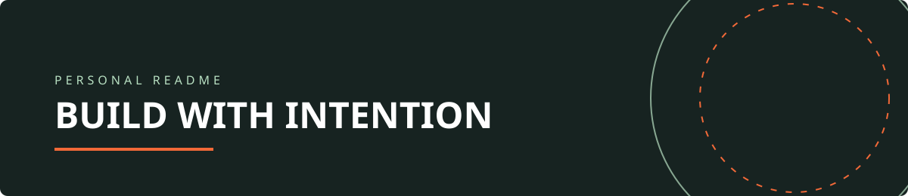
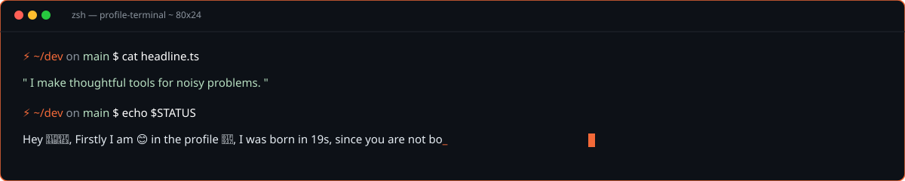
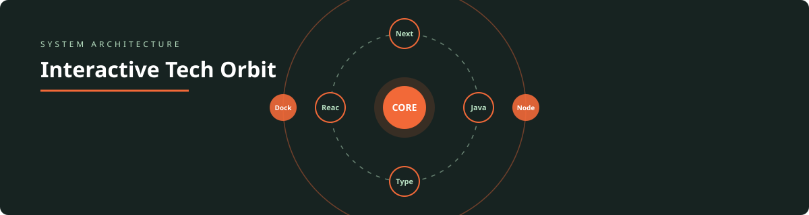
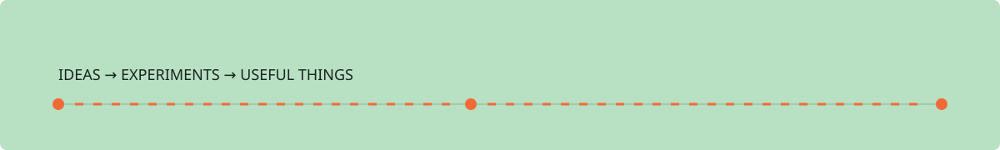
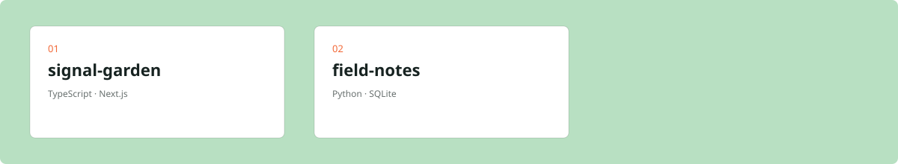

# Hey, I'm Muhammad Adamu Said  👋

> I make thoughtful tools for noisy problems.

Hey 👋📣,  Firstly I am 😊 in the profile 🤷, I was born in 19s, since you are not born yet 😎, and then gradually, gradually I who I am now

📍 Jalingo, Nigeria · [GitHub](https://github.com/JauronyX)

### ⚡ Tech Stack

     

## A few signals

## Things I'm building

### 1. signal-garden

A tiny observability layer for calm, useful software.

**TypeScript · Next.js**

### 2. field-notes

A searchable notebook for ideas that want to become real.

**Python · SQLite**

## Contribution trail

## Find me

[GitHub](https://github.com/JauronyX) · [LinkedIn](https://linkedin.com/in/JauronyX) · hello@example.com

